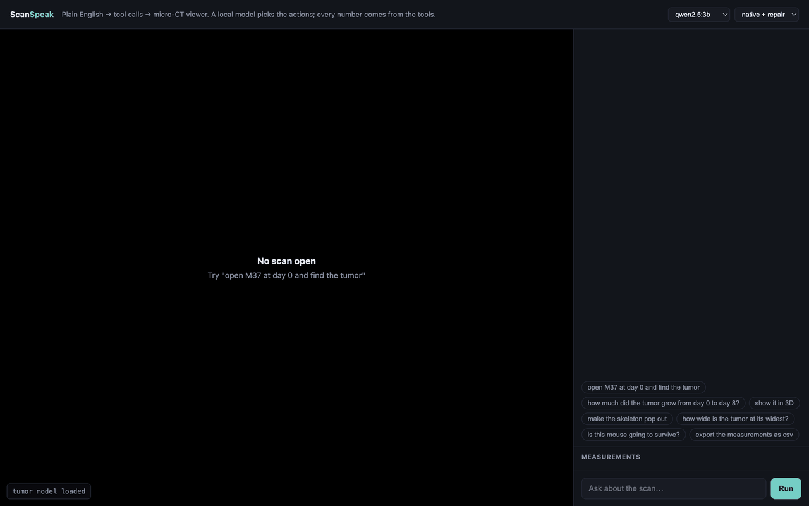
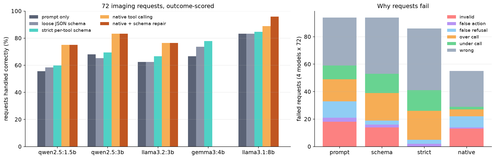

# ScanSpeak

**Type plain English at a mouse micro-CT scan, and a small language model running on your laptop drives the viewer.** "Open M37 at day 0, find the tumor, how much did it grow by day 8?" turns into tool calls that load the scan, run an AI tumor segmenter, and report the growth. The language model only picks actions. Every number comes from the tools, so it can't make up a tumor volume.

**Interactive write-up: [mohithgajjela.com/system-07-scanspeak](https://mohithgajjela.com/system-07-scanspeak)**. Replay a recorded session step by step, and browse every benchmark output by model and decoding mode.



It runs as a browser app (NiiVue viewer) and as a 3D Slicer module. Both share one agent, one tool schema and one measurement backend. The scans are real preclinical micro-CT from the public TumSeg database, using mice the tumor model never trained on.

## What I measured

A local assistant inside imaging software is only useful if a *small* model (1.5B to 8B, offline, no API key) picks the right action reliably. So I wrote a 72-request benchmark (biologist wording, multi-step asks, longitudinal comparisons, out-of-scope requests that should be refused) and ran 5 local models through 4 ways of getting structured output:

| decoding mode | what it does | mean accuracy, 4 tool-capable models (72 requests) | held-out (24 requests) |
|---|---|---|---|
| prompt only | ask for JSON, parse what comes back | 67.4% | not run |
| loose JSON schema | grammar-constrained JSON, tool names forced to be real | 67.4% | not run |
| strict per-tool schema | grammar forces every argument name, enum and type | 70.1% | 80.2% |
| native tool calling | the model's built-in tool-call format | 80.9% | 86.5% |
| **native + schema repair** | native, then a ~30-line type fixer (`"False"` → `false`, `"0.3"` → `0.3`) | **82.6%** | **89.6%** |



**Main finding: forcing valid JSON doesn't make the model pick the right actions.** Strict grammar-constrained decoding drove invalid calls to exactly 0, but it was still about 11 points worse than native tool calling. The failure breakdown on the right shows why: when the output is a JSON array, models pad it with actions nobody asked for, like an extra `measure` or `export` tacked onto a comparison. Over-calling and under-calling make up 36 of strict's 86 failures, against 7 of native's 55. Native mode's own main failure was the opposite kind: right tool, right value, wrong JSON type. A schema-driven repair step fixes those without any model involvement. It took llama3.1:8b from 88.9% to 95.8% on the main set and from 79.2% to 91.7% on held-out.

Smallest model that's actually usable: **qwen2.5:1.5b with native tool calling handled 75% of the main set and 96% of the held-out set**, at a median 0.4 s per request.

### Honesty notes
- **Two fixes were designed after looking at failures:** the schema repair and a "only emit the calls you need" prompt rule (`*_min` modes). To check they weren't just fit to those 72 cases, I wrote 24 new held-out requests before running anything on them. The repair held up. The prompt rule did not: it moved strict mode between −8 and +4 points depending on the model and did nothing for native. I'm reporting it as a negative result.
- **Scoring is outcome-based.** Both the model's calls and the gold calls run on a small simulated viewer. A case passes only if the final viewer state *and* the set of numbers reported to the user match. That forgives harmless differences (segmenting before measuring, re-opening the scan that's already open) but not wrong numbers, wrong views, or unrequested side effects. Exact call-sequence match is also reported in `results/summary.json`.
- **This is one run at temperature 0.** n = 72 and 24 is small, so differences of a few points between models aren't meaningful. On the main set, native beats strict for all 4 models (by 4 to 15 points). On held-out, native + repair beats strict for 3 of 4 models. llama3.2:3b is the exception, where strict did better (87.5% vs 79.2%).
- **Latency was measured while a CPU training job ran on the same machine,** so the absolute latencies are pessimistic.
- gemma3:4b has no native tool-calling support in Ollama, so it only appears in the JSON modes.
- **The 3D Slicer module is written and unit-tested against stubbed Slicer APIs (`tests/`), but I couldn't run it inside real Slicer here,** because the build sandbox couldn't mount the Slicer installer. The browser app was tested end to end on real scans.

## How it works

```
"how much did the tumor grow since day 0?"
        │
        ▼
  local LLM (Ollama) ── sees: 11 tool definitions + current viewer state
        │                 emits: compare_timepoints(tumor, volume, day0, day8)
        ▼
  schema repair + validation        (scanspeak/tools.py)
        │
        ▼
  backend executes the tool         (scanspeak/backends/volume_backend.py)
    - loads both NIfTI scans, runs the 3D U-Net tumor segmenter
    - computes volumes from voxel counts x real voxel size
        │
        ├──► reply text built from tool outputs: "484.2 mm³ at day0 → 927.2 mm³ at day8 (+91%)"
        └──► view ops ─► NiiVue in the browser   (web/index.html)
                     └─► or 3D Slicer's scene   (slicer/ScanSpeak/ScanSpeak.py)
```

The tool set: `load_scan, set_window, segment, measure, compare_timepoints, set_layout, focus_on, set_visibility, set_opacity, export_measurements, reset_view`. Body, bone and lungs use intensity rules. Tumor segmentation uses the reference 3D U-Net from my companion project [Fauxgraft](https://github.com/Mohith26/fauxgraft), trained on the 325 labeled training scans. On held-out mice it gets Dice 0.72 (human vs human is 0.90) and a median tumor-volume error of 14%.

The demo shows its limits honestly. For mouse M37 it reports 484 → 927 mm³ (+91%) from day 0 to day 8. The expert consensus says 382 → 925 mm³ (+142%): day 8 is almost exactly right, but day 0 is inflated by a few false-positive blobs (on the chest, a knee and near the tail), which you can see in the 3D view. M37 has only one tumor. The agent layer is the point of this repo, not the segmenter: a better tumor model drops in through `SCANSPEAK_TUMOR_MODEL` with no other changes.

## Run it

```bash
pip install -r requirements.txt
ollama pull qwen2.5:3b            # or qwen2.5:1.5b / llama3.1:8b
bash ../fauxgraft/scripts/get_data.sh   # TumSeg scans (2.2 GB) -> set TUMSEG_DIR to the unzipped folder
export TUMSEG_DIR="/path/to/TumSeg database"
export SCANSPEAK_TUMOR_MODEL=models/tumor_unet.pt
python3 -m scanspeak.server --port 8417
# open http://127.0.0.1:8417
```

Reproduce the benchmark (needs only Ollama, no scans):

```bash
python3 -u bench/run_bench.py                      # 72 cases x models x modes, resumable
python3 -u bench/run_bench.py --set heldout --modes strict native
python3 bench/analyze.py && python3 bench/analyze.py --repair
```

3D Slicer: add `slicer/ScanSpeak` under Edit → Application Settings → Modules → Additional module paths. Restart, then open ScanSpeak (Examples category).

## Explaining it in 30 seconds

"Biologists using imaging software want a number, like how big the tumor is or how much it grew, not a picture. So I built a natural-language layer where a small model running locally turns a request into tool calls, and the tools produce the numbers. That way the model can't make up a measurement. Then I benchmarked which way of getting structured output from small models actually works. The surprise was that forcing perfectly valid JSON with a grammar made accuracy *worse*, because models padded their action lists. The best setup was the model's native tool-calling format plus a tiny type-repair step, which got an 8B model from 89% to 96%."

## Data

Jensen et al., *3D whole body preclinical micro-CT database of subcutaneous tumors in mice with annotations from 3 annotators*, Scientific Data 2024 (CC-BY). The files store an identity sform next to the correct 0.21 mm qform, so all physical units here come from the header's pixdim.
